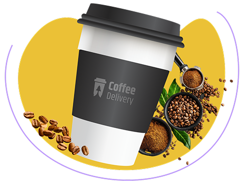

<p align="start">
    
</p>


# Coffee Delivery

## Links do Projeto

- [Sobre o desafio](https://efficient-sloth-d85.notion.site/Desafio-02-Coffee-Delivery-30e42a21fdb44b09a85244fc2c3dbdf9)
- [Figma](https://www.figma.com/design/5yT9ZzZmRQRS4yivGGB3pl/Coffee-Delivery-%E2%80%A2-Desafio-React?node-id=2-12&p=f&t=ApkjsifcG04PI7BE-0)

## Conceitos aplicados
- Estados
- ContextAPI
- LocalStorage
- Imutabilidade do estado
- Listas e chaves no ReactJS
- Propriedades
- Componentização

## Executando

1. Clonando o repositório


```bash
git clone https://github.com/luksquitos/ignite-coffee.git
```

2. Instalando dependências 

```bash
cd ignite-coffee
npm i
```

3. Iniciando aplicação

```bash
npm start dev
```

## Acessando a aplicação
A aplicação pode ser acessada em `http://localhost:5173`. 